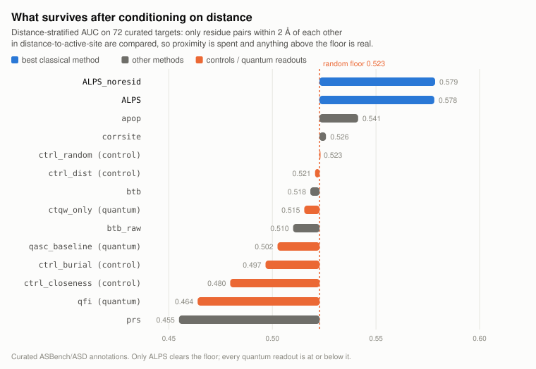
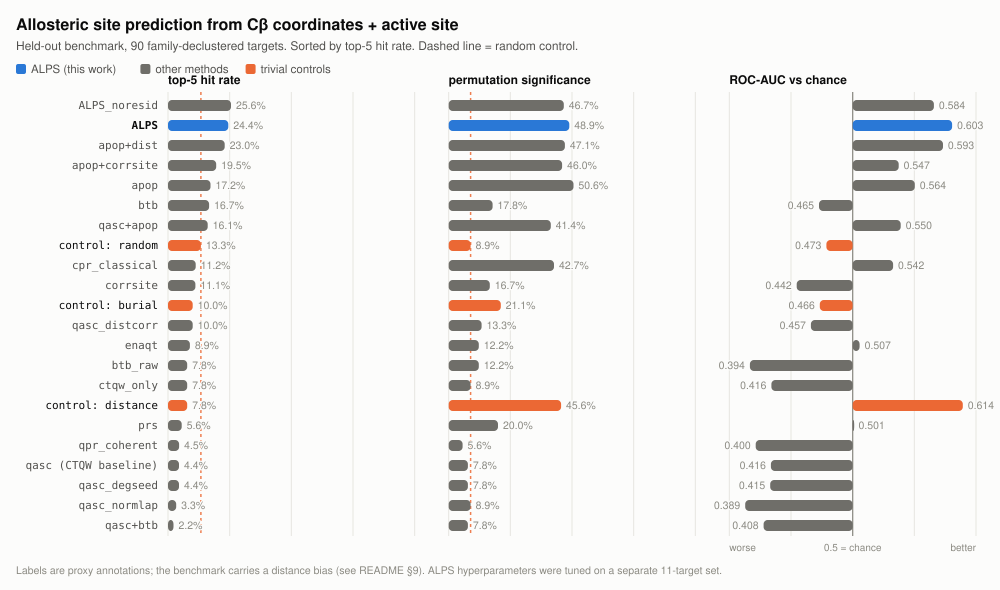

# allosteric-benchmark

Can a quantum walk predict allosteric sites better than classical methods on the same
input? This repository was built to answer that. On a benchmark with **geometric proxy
labels** the answer was a consistent no across seven insertion points — and then a check
against **curated** allosteric annotations (section 9) reversed several of those
rankings, including that one. It ships the benchmark, the controls, the curated
cross-check, and the code behind all of it.

> **Read section 9 first.** The curated-label check invalidates three claims this
> repository previously led with, including "ALPS is the best method" and "the CTQW
> baseline performs at random level". Both were properties of the proxy labels.

Everything works from the same minimal input: **per-residue Cβ coordinates plus the
active-site residue indices**, nothing else. No MD trajectories, no bound (holo)
reference structure, no learned weights at inference. Reproducible from public data
with `numpy` + `scipy`.

**Three deliverables:**

1. **A benchmark with trivial controls.** Family-declustered targets built straight from
   RCSB PDB, because the field's standard benchmark servers (ASD, ASBench, CASBench) are
   currently unreachable. Every result is reported beside a distance-only, a burial-only
   and a random control — because on this task those controls are strong, and several
   published-method ports do not beat them.
2. **A systematic negative result on quantum walks**, with the mechanism measured rather
   than asserted, and two self-corrections recorded in place where a small-sample
   finding did not survive a larger one.
3. **ALPS**, a classical method that came out of the comparison: perturb the contact
   graph locally, read the shift in the three lowest Kirchhoff eigenvalues, z-score
   against distance. Every design decision traces to a measurement in section 3 — and
   section 9 shows the last of those decisions was tuned against an artefact.

> **On the quantum framing.** The Kirchhoff matrix ALPS reads *is* the continuous-time
> quantum walk Hamiltonian, so "how does ligand binding retune the walk's low-lying
> spectrum" is a fair description of it. It is equally a description of the Gaussian
> Network Model's slowest vibrational modes — the same numbers. **No quantum advantage
> is claimed anywhere in this repository**, and section 5 records the seven attempts
> that failed to find one.

---

## TL;DR

**What the controls show.** On 101 independent targets a distance-only control
(`score = distance from the active site`) reaches 46–55% permutation significance and
the highest AUC of anything tested. **A method that does not beat that control has not
demonstrated anything** — and most published-method ports here do not.

**What ALPS achieves — on proxy labels.** It leads on localisation: 24.4% top-5 hit rate
against 7.8% for the distance control, rising to 35.6% with spatial diversification.

**What the curated check says.** On 73 targets with expert annotations, ALPS is **sixth of
twelve on AUC** (0.577). Bond-to-bond without distance correction leads (0.618), and the
CTQW baseline this repo set out to test reaches 0.590 — above the random control and
above ALPS. ALPS's distance z-score, the component its design credits most, *costs*
accuracy once the labels are real (0.577 with, 0.598 without), because it corrects for a
bias that only our own label construction had. **No method reaches DCC ≤ 4 Å** on more
than 1.9% of targets. Nothing here is a drug-discovery tool.

**What happened to the quantum walk.** Seven insertion points measured, seven failed:
coherent transfer amplitude; coherent transfer inside the perturbation framework; ENAQT
dephasing; degeneracy structure; eigenvector content; cooperative selection as a QUBO;
and degeneracy-sensitive readouts on symmetric multimers. The QUBO framing is
mathematically sound — the objective is genuinely frustrated — but classical annealing
solves it exactly at every size tested. Symmetry really does enrich spectral degeneracy
(6.5% vs 3.1%), just not enough for interference to carry the signal. Section 5 records
what could still plausibly remain, and it is a *cost* argument, not an accuracy one.

**What to distrust.** The main benchmark's labels are geometric proxies, and section 9
shows that matters more than any other caveat here: on curated annotations the method
ranking reorders, ALPS drops to sixth, the CTQW baseline rises above it, and the distance
bias that shaped several design decisions turns out to be an artefact of our own label
construction (`ctrl_dist` goes from strongest-thing-tested to AUC 0.383, below chance).
Four findings in this file reversed when the sample or the labels changed (sections 6, 8,
9, and the learned-combiner disclosure); every earlier reading is kept rather than
deleted.

<picture>
  <source media="(prefers-color-scheme: dark)" srcset="docs/stratified-dark.svg">
  
</picture>

*The headline result, on the only metric here that is not confounded by proximity
(section 9.4): curated labels, distance-matched pairs, bars measured from the random
control rather than from zero. Only ALPS clears the floor; every quantum readout falls
short of it.*

---

## 1. Why build a new benchmark

The standard annotated benchmarks for this task are effectively offline:

| Resource | Status (checked Aug 2026) |
|---|---|
| ASD [Huang et al. 2010] (`mdl.shsmu.edu.cn/ASD/`) | Server unreachable over HTTPS; download links are JS-driven and not machine-retrievable |
| CASBench [Zlobin et al. 2019] (`mdl.shsmu.edu.cn/CASBench/`) | HTTP 404 |
| `casbench.org` | Does not resolve |

So the benchmark is rebuilt from primary data. Sites are defined the way ASBench [Huang et al. 2015] and
CASBench [Zlobin et al. 2019] define them — by the residues that directly contact the crystallographic ligand:

| Field | Rule |
|---|---|
| `anchor` (orthosteric / active site) | residues with any heavy atom within **4.5 Å** of a **cofactor** ligand (nucleotides, NAD/FAD/SAM/CoA/PLP, porphyrins, sugar-phosphates) |
| `y` (allosteric site) | residues within **4.5 Å** of a **drug-like** ligand: ≥ 12 heavy atoms, contains N/S/halogen (excludes PEG and glycerol, which are C/O only), not a cofactor, not a crystallisation additive |
| keep if | the two sites are disjoint and separated by **≥ 8 Å** |

Two tiers, both deduplicated by UniProt accession via PDBe SIFTS so no protein family is
represented twice:

- **tier-A** (11 targets) — candidates restricted to entries whose RCSB full text mentions
  *allosteric*, i.e. the depositors themselves flagged the structure as allosteric.
  Higher-confidence labels. **Used for tuning.**
- **tier-B** (90 targets) — candidates from a generic "cofactor + ≥ 2 ligands" query.
  Purely geometric proxy labels. **Held out; never used for tuning.**

### ⚠️ The labels are a proxy, not expert curation

`y` means *"a drug-like molecule was crystallised here, far from the catalytic site"*.
That is the field's operational definition of a candidate allosteric site, and it is what
ASBench-style sets encode — but it is **not** the same as an experimentally validated
allosteric regulatory site. Every conclusion drawn from this benchmark carries that caveat.

---

## 2. Methods implemented

All in [`methods/`](methods/); every one consumes only Cβ coordinates + anchor indices, and
all share identical post-processing (rank percentile → graph smoothing) and candidate pool.

**Quantum-walk channels** ([`quantum.py`](methods/quantum.py))

| Name | Description |
|---|---|
| `qasc_baseline` | Laplacian-CTQW infinite-time-averaged communicability [Mülken & Blumen 2011] + adjacency-matrix IPR resonant transfer, fused by noisy-or (a reimplementation of [QASC](https://github.com/Arthur031221/quantum-allosteric-scanner)) |
| `qasc_degseed` | Same, but the IPR channel is seeded with a **degree-weighted** state. The uniform superposition is a zero-eigenvalue eigenvector of the Laplacian but *not* an eigenvector of the adjacency matrix, so under an adjacency-generated walk it drifts with no driving; degree weighting is the natural initial condition [Wong et al. 2016] |
| `qasc_normlap` | Symmetric normalized Laplacian, to remove the degree heterogeneity that degrades coherent walks on hub-dominated graphs [Mülken & Blumen 2011] |
| `enaqt` | Lindblad pure-dephasing transport [Maier et al. 2019] with the dephasing rate **calibrated in units of the largest coupling** and efficiency defined as a finite-window time integral of site occupation |

**Classical / elastic-network** ([`btb.py`](methods/btb.py), [`enm.py`](methods/enm.py))

| Name | Description |
|---|---|
| `btb` | Bond-to-bond propensity [Amor et al. 2016; Hodges et al. 2018; Wu et al. 2022] ported to the residue graph: `M = ½ G Bᵀ L† B` (Green's function of the weighted Laplacian), seeded at the active site, with conditional quantile regression against distance. Only the source columns are formed, never the full m×m matrix |
| `apop` | Stiffen a local neighbourhood to mimic ligand binding, rank by the induced shift in global mode frequencies. **Does not use the anchor at all** [Kumar et al. 2023] |
| `corrsite` | GNM slow-mode and fast-mode motion correlation to the anchor, scored as the max of the two Z-scores [Xie et al. 2021] |
| `prs` | Perturbation-response scanning: the GNM covariance is the linear response operator [Atilgan & Atilgan 2009] |

**Not implemented here, but the relevant comparison points.** These need input this
benchmark deliberately withholds — a pocket detector, a sequence alignment, or a
trained model — so they are cited rather than run: pocket-detection-based predictors
`Allosite` [Huang et al. 2013] and the `PASSer` family
[Tian et al. 2023a; Tian et al. 2023b], all of which depend on `fpocket`
[Le Guilloux et al. 2009]; the residue-centric,
pocket-free `STINGAllo` [Omage et al. 2025]; the cryptic-pocket GNN `PocketMiner`
[Meller et al. 2023]; the elastic-network + ML hybrid `AlloPred`
[Greener & Sternberg 2015]; the transfer-entropy ensemble `AlloEF` [Zhang et al. 2026];
the sequence-only
`Allo-Allo` [Dong et al. 2024]; and the coevolution-based `KeyAlloSite` [Xie et al. 2023].

**Trivial controls — the point of the whole exercise**

| Name | Description |
|---|---|
| `ctrl_dist` | distance from the anchor. No graph, no model |
| `ctrl_burial` | contact degree |
| `ctrl_random` | random numbers, to calibrate the false-positive rate of the criterion itself |

---

## 3. ALPS — the method this study converged on

[`methods/alps.py`](methods/alps.py)

```
score(i) = z_d[ Σ_{k ≤ K} |λ_k(H_i) − λ_k(H_0)| / λ_k(H_0) ]
```

`H_0` is the Kirchhoff matrix of the contact graph; `H_i` is the same matrix with every
edge inside residue *i*'s 10 Å neighbourhood stiffened by ×2 to mimic a ligand binding
there; `λ_1..K` are the **lowest K = 3 non-zero eigenvalues**; `z_d[·]` is a
distance-conditional z-score against residues at comparable distance from the active site.

Each design decision answers something measured here, not a hunch:

| Decision | Evidence |
|---|---|
| Perturbation response, not a propagation amplitude | The CTQW score correlates with distance-to-anchor at **−0.60 to −0.71** across all three sets — it is substantially a proximity ranker, and its AUC falls **below 0.5** on independent targets. A difference cancels the baseline proximity structure |
| Read the **spectrum**, not the transfer | Inside one identical perturb-and-read framework, infinite-time coherent transfer, finite-window coherent transfer and classical diffusion all lost to the spectral readout (9–27% vs 91% on tier-A). Local stiffening barely moves the eigenvalue *degeneracies* that govern long-time coherent transfer, so that observable is noise-dominated; it moves the low-lying eigenvalues cleanly |
| Only the lowest 3 modes | K = 3 beat K = 5 and K = 10. Allosteric leverage lives in global collective motion; higher modes add local noise |
| Distance-conditional z-score | Lifted this method from 82% → 91% on tier-A, and lifted the CTQW baseline from 9% → 27% |

**Dual reading of the operator.** The Kirchhoff matrix is simultaneously the CTQW
Hamiltonian [Mülken & Blumen 2011] and the Gaussian Network Model operator
[Bahar et al. 1997]. Its low-lying eigenvalues are the
slowest coherent frequencies of the quantum walk *and* the slowest vibrational modes of
the elastic network — the same numbers. ALPS measures how a local binding event retunes
that shared spectrum.

> **No quantum advantage is claimed.** The classical and quantum readings of this quantity
> are identical, and in this study the explicitly coherent observables performed *worse*.

---

## 4. Results

> ⚠️ **The rankings in this section are confounded.** They use geometric proxy labels
> and plain AUC, and section 9 shows both are dominated by distance — `ctrl_dist` is the
> strongest thing here and anti-predictive on curated labels. The table below is kept as
> the record of what the proxy benchmark said; **the figure for the metric the
> conclusions rest on is at the top of this file**, and the confounded three-panel
> version has moved to the appendix.

`sig` = fraction with permutation p < 0.05 · `AUC` = ROC-AUC inside the candidate pool
(0.5 = chance) · `hit5` = top-5 contains a true allosteric residue.

**tier-B is the only column not contaminated by tuning and should be read as the result.**

| Method | QASC's own 3<br>sig / AUC | tier-A (tuning, n=11)<br>sig / AUC | **tier-B (held out, n=90)<br>sig / AUC / hit5** |
|---|---|---|---|
| **`ALPS`** | 33% / 0.619 | 90.9% / 0.757 | **48.9% / 0.603 / 24.4%** |
| `ALPS_noresid` | 0% / 0.620 | 90.9% / 0.722 | 46.7% / 0.584 / 25.6% |
| `apop` | 0% / 0.512 | 80.0% / 0.733 | 50.6% / 0.564 / 17.2% |
| `apop+dist` | 0% / 0.487 | 80.0% / 0.753 | 47.1% / 0.593 / 23.0% |
| `cpr_classical` | 0% / 0.519 | 27.3% / 0.596 | 42.7% / 0.542 / 11.2% |
| `qpr_coherent` | 0% / 0.440 | 9.1% / 0.358 | 5.6% / 0.400 / 4.5% |
| `ctrl_dist` | 0% / 0.432 | 54.5% / 0.583 | 45.6% / 0.614 / 7.8% |
| `ctrl_burial` | 33% / 0.631 | 45.5% / 0.613 | 21.1% / 0.466 / 10.0% |
| `ctrl_random` | 0% / 0.542 | 9.1% / 0.489 | 8.9% / 0.473 / 13.3% |
| `qasc_baseline` | 100% / 0.731 | 9.1% / 0.412 | **7.8% / 0.416 / 4.4%** |
| `qasc_degseed` | 100% / 0.732 | 18.2% / 0.413 | 7.8% / 0.415 / 4.4% |
| `qasc_distcorr` | 67% / 0.742 | 27.3% / 0.474 | 13.3% / 0.457 / 10.0% |
| `btb` | 0% / 0.301 | 18.2% / 0.446 | 17.8% / 0.465 / 16.7% |
| `corrsite` | 0% / 0.445 | 27.3% / 0.534 | 16.7% / 0.442 / 11.1% |
| `prs` | 0% / 0.365 | 18.2% / 0.492 | 20.0% / 0.501 / 5.6% |
| `enaqt` | 0% / 0.518 | 9.1% / 0.511 | 12.2% / 0.507 / 8.9% |

### 4.1 The honest reading of ALPS

On the 90 held-out targets ALPS beats the distance-only control on significance
(48.9% vs 45.6%) but that margin is small and inside the confidence interval. The
substantial win is **localisation**: a 24.4% top-5 hit rate against 7.8% for the distance
control — 3.1× — and 17.2% for `apop`, the strongest published-method port. ALPS also has
the best in-pool ranking quality (AUC 0.603 vs 0.564 for `apop`) and the shortest median
DCC of the strong methods (20.2 Å vs 26.4 Å).

`apop` edges ALPS on raw significance rate (50.6% vs 48.9%) while losing on AUC, hit5 and
DCC. If the deliverable is "five residues worth testing experimentally", ALPS is the better
choice; if it is "does this protein show any enrichment at all", they are equivalent.

Removing the distance z-score (`ALPS_noresid`) costs significance (46.7%) and AUC (0.584)
but not hit rate (25.6%), so the residualisation sharpens the ranking overall rather than
the very top of it.

The tier-A → tier-B drop (90.9% → 48.9%) has two causes and both should be stated:
hyperparameters were selected on tier-A, and tier-A's labels are higher quality.

### 4.2 Ablations — which observable actually carries the signal

Two ablations, both holding the graph, the perturbation and the distance
conditioning fixed and varying only what is read out.

**(a) The propagator.** Identical perturbation and readout location; only the kernel changes:

| Readout | tier-A sig / AUC |
|---|---|
| Infinite-time coherent transfer (the CTQW observable) | 9.1% / 0.475 |
| Finite-window coherent transfer | 9.1% / 0.358 |
| Classical diffusion kernel | 27.3% / 0.596 |
| **Low-lying spectral shift (ALPS)** | **90.9% / 0.757** |

**(b) The spectral quantity.** Given that a spectral readout wins, *which* spectral
quantity? `scripts/ablate_readouts.py`, tier-A, K = 3 modes throughout:

| Readout | sig | median p | AUC | hit5 |
|---|---|---|---|---|
| **`dlam` — eigenvalue shift (ALPS)** | **90.9%** | **0.0003** | **0.757** | **36.4%** |
| `dpart` — change in active-site participation in the low modes | 63.6% | 0.0196 | 0.682 | 18.2% |
| `dgap` — change in level *spacings* (degeneracy structure) | 54.5% | 0.0013 | 0.660 | 18.2% |
| `dipr` — change in mode localisation (inverse participation ratio) | 36.4% | 0.0865 | 0.637 | 9.1% |

The last three are the *quantum-specific* quantities: degeneracy structure and
eigenvector content, which is what would carry the signal if interference were doing
the work. Plain eigenvalue magnitude beats all of them.

### 4.3 On the CTQW baseline

Reported in both directions, because both are true:

- **It is not an artefact on its own targets.** On the three targets shipped with QASC it
  reaches 100% significance and AUC 0.731 while *all three* trivial controls fail
  (distance 0%, random 0%, burial 33%). That result is real and survives the controls.
- **It does not transfer.** On 101 independent targets it sits at or below the random
  control (7.8% vs 8.9% on the 90 held-out targets), with AUC consistently below 0.5
  (0.412, 0.416) and a top-5 hit rate of 4.4% against the random control's 13.3%.
- **The mechanism is measurable.** Its score correlates with distance-to-anchor at −0.713 /
  −0.621 / −0.604 on the three sets — it is largely a proximity ranker. On its own three
  targets the annotated allosteric residues happen to sit **4.2 Å closer** to the active
  site than the distal background, so a proximity ranker succeeds; on the independent sets
  they sit farther (+1.0 Å, +4.0 Å) and the same ranker inverts, which is exactly why AUC
  drops below 0.5.

This is a property of a specific scoring function on a specific set of targets, not a
judgement of the idea. Two of the fixes tried here (degree-weighted seeding, distance
conditioning) improve it measurably.

### 4.4 Nothing localises to 4 Å

DCC ≤ 4 Å success — the localisation criterion used by `STINGAllo` [Omage et al. 2025] —
is **0% for every method on every set**; median DCC is 18–33 Å. Note that
`ctrl_random` posts a *median* DCC of 20.5 Å, so median DCC alone is easy to game by
predicting near the protein centre — read it together with `hit5`, never alone.

---

## 5. Where a quantum walk can and cannot sit in this pipeline

Because the project started from a quantum-walk method, it is worth stating precisely
what was tested and what remains open. Five insertion points have now been measured and
all five failed:

| Insertion point | Result |
|---|---|
| Absolute CTQW transfer amplitude as the score (QASC's design) | Fails — the score correlates −0.60 to −0.71 with distance-to-anchor; it is largely a proximity ranker |
| Coherent transfer as the readout inside the perturbation framework | 9.1% significant, versus 90.9% for the spectral readout |
| ENAQT / dephasing-assisted transport | γ swept from 0 to 3·J_max with the rate calibrated to the hopping scale; no optimum appears, results stay at chance |
| Degeneracy structure (level spacings) under perturbation | 54.5%, versus 90.9% for plain eigenvalue shift |
| Eigenvector content (active-site participation, mode IPR) | 63.6% and 36.4% |
| **Cooperative site selection as a QUBO** (section 6) | The objective *is* frustrated and greedy *is* suboptimal, but classical annealing hits the exhaustive optimum at every size up to C(34,7) = 5.4M, the quadratic surrogate carries 37.9% error, and the exact optimum has no biological advantage over random selection |
| **Degeneracy-sensitive readouts on symmetric multimers** (section 8) | Symmetry really does enrich near-degeneracies (6.5% vs 3.1%), but the degeneracy-sensitive readout still loses to the plain eigenvalue shift there, and is marginally worse than in the asymmetric group |
| **Chiral quantum walks** — complex hopping phases breaking time-reversal symmetry ([`docs/quantum-observable-search.md`](docs/quantum-observable-search.md)) | The only candidate whose precondition our graphs satisfy — cycles, not degeneracy, 7.7–8.3 per residue. Scored by the directional asymmetry, which is *exactly zero* without chirality so it cannot collapse into the failed transfer amplitude. AUC 0.318–0.565 against 0.757 for the time-symmetric readout |
| **Quantum kernels / quantum ML** | Not implemented, and the literature says not to: bandwidth-tuned quantum kernels become numerically indistinguishable from an RBF kernel, and on small tabular data classical beats quantum by 18.1 points with none of 29 paired comparisons significant. Our feature vector is 7-dimensional — exactly the regime where a quantum kernel collapses to a polynomial one. A classical learned combiner on our own data reaches AUC 0.668 (on 59 of 89 eligible targets — see the disclosure in that file), and that is what a quantum model would have to beat |

**Where a quantum walk legitimately already sits.** The λ_k that ALPS reads *are* the
eigenvalues of the CTQW Hamiltonian — the slowest coherent frequencies of the walk. "How
does ligand binding retune the walk's low-lying spectrum" is a fair description of the
method. It is equally a description of the Gaussian Network Model's slowest vibrational
modes, so this is a *framing*, not an advantage, and this repository does not present it
as one.

Combinatorial selection was the most promising remaining candidate and it has now been
tested too — section 6 has the full result. A second literature search then went looking specifically for quantum observables whose
signal does *not* come from degeneracy — OTOCs, operator growth, Krylov complexity,
Lieb-Robinson light cones, quantum Fisher information, non-Hermitian sensing, chiral
walks. Four more candidates measured, three closed, one still open:
[`docs/quantum-observable-search.md`](docs/quantum-observable-search.md). The short
version is that an OTOC on a single-particle hopping model is *algebraically* four times
the squared transfer amplitude — the observable already rejected — and the same collapse
happens to Lieb-Robinson. Chiral quantum walks were the one candidate whose precondition
our graphs satisfy (cycles, not degeneracy: 7.7–8.3 per residue against 3.6%
near-degenerate gaps), and they were implemented and measured too. **The precondition
held and the observable was still uninformative.**

**Beyond that, what is left is two things, and the first
one is not about accuracy at all:**

1. **Algorithmic speedup rather than a better estimator.** Every negative result above is
   about quantum failing to *predict* better. None of them touches cost. ALPS needs N
   eigendecompositions, O(N⁴), and the cooperative experiment showed the true bottleneck
   is building the coupling matrix — C(N, 2) eigendecompositions — not the search over
   it. Estimating spectral shifts by quantum phase estimation on the walk operator would
   not require full diagonalisation. This is the one framing that survives everything
   measured here, precisely because it never claims better predictions.
2. ~~Symmetric multimers.~~ **Tested and closed** — section 8. Symmetry does enrich
   spectral degeneracy, but not enough for an interference-dependent readout to win
   there. This was the last mechanism-backed candidate, and only the cost argument
   above now remains.

**Not worth further tuning:** more variants of the coherent readout (different time
scales, initial states, Hamiltonian normalisations). Five have been tried and they land
between chance and 27%, against 91% for the spectral readout. That gap is not a
hyperparameter problem.

---

## 6. Cooperative selection: is it a hard combinatorial problem?

Single-residue perturbation is easy classically. The biological question behind
cooperative allostery is harder: which **set** of k residues, stiffened together,
maximally retunes the active-site spectrum? That is C(N, k) — about 2 × 10¹⁰ for
N = 300, k = 5 — and it maps onto a QUBO/Ising form, which is the shape a quantum
annealer or QAOA consumes. `methods/cooperative.py` and `scripts/cooperative.py`
test whether that framing earns its keep, before proposing any solver for it.

The surrogate is `f(S) ≈ Σ h_i x_i + Σ J_ij x_i x_j`, with `h_i = f({i})` the
single-residue response and `J_ij = f({i,j}) − f({i}) − f({j})` the non-additive
part, both computed exactly by eigendecomposition on a score-shortlisted candidate
set.

**The objective really is non-additive and frustrated.** This part passes:

| | tier-A (n=11) | tier-B held out (n=89) |
|---|---|---|
| median \|J_ij\| / mean h | 0.194 | 0.211 |
| pairs with \|J\| > 10% of h | 68.2% | 69.0% |
| couplings that are negative | 39.8% | 39.7% |
| greedy finds the exact optimum | 9% of targets | 7% of targets |
| greedy shortfall vs exact | 3.9% | 8.2% |

Roughly 40% of the couplings are negative, i.e. genuinely frustrated — the
structure that makes Ising problems hard — and greedy selection is measurably
suboptimal. So the QUBO framing is legitimate, not a retrofit.

**But three independent findings close the door on a quantum solver here.**

*1. Classical annealing already solves it exactly.* Simulated annealing matched
the exhaustive optimum on every target at every size tested:

| candidates M | k | C(M, k) | annealing = exact optimum |
|---|---|---|---|
| 26 | 5 | 65,780 | ✓ all targets |
| 34 | 5 | 278,256 | ✓ |
| 40 | 6 | 3,838,380 | ✓ |
| 34 | 7 | **5,379,616** | ✓ |

The residual gaps are ~1e-16, i.e. floating point. There is no headroom for a
better search. And the real cost is not the search at all — it is building `J`,
which needs C(N, 2) eigendecompositions. The oracle is the bottleneck, not the
optimiser.

*2. Solving the surrogate exactly gives a worse true answer than greedy.* The
quadratic approximation carries 16.4% (tier-A) and **37.9%** (tier-B) relative
error against the true eigenvalue objective. On the held-out set the exhaustive
QUBO optimum scores **f(S) = 0.797** under the true objective while greedy's set
scores **0.843**. Optimising the surrogate harder makes the real answer worse.

*3. The QUBO optimum has no biological advantage on held-out data.* Hit rate for
finding a true allosteric residue, tier-B (n=89):

| selection | hit rate |
|---|---|
| top-k by single-residue score | 23.6% |
| greedy on the QUBO | 24.7% |
| **exhaustive QUBO optimum** | **23.6%** |
| CONTROL random k-subset of the same candidates | 25.7% |
| CONTROL maximum spatial spread over the same candidates | **36.0%** |

The exactly-solved QUBO does not beat picking at random from the same shortlist.
A trivial spread heuristic beats all of them. On tier-A (n = 11) the QUBO looked
good at 45.5%; that did not survive n = 89, which is a reminder of what an
11-target tuning set can and cannot support.

**Verdict.** The formulation is mathematically sound and the problem is genuinely
frustrated, but classical annealing saturates it, the surrogate is too lossy to
be worth optimising exactly, and the result carries no biological benefit. This
was the most promising remaining place to put a quantum solver, and it does not
hold up.

---

## 7. What the controls found instead: diversify the top-k

The control that beat the QUBO turned out to be a real, cheap improvement to the
method. The k highest-scoring residues are usually contacts of each other — mean
pairwise separation 8.2 Å — so five of them describe **one site five times**.

`scripts/diversify.py`, held-out tier-B (n = 90):

| selection | hit rate | mean spread |
|---|---|---|
| top-5 by score (what ALPS did) | 24.4% | 8.2 Å |
| score, then ≥ 10 Å minimum separation | 31.1% | 16.5 Å |
| **score shortlists top-26, then maximum spread** | **35.6%** | 17.9 Å |
| CONTROL same spread rule over the whole distal pool | **10.0%** | 34.9 Å |
| CONTROL random 5 from the whole distal pool | 17.8% | 22.4 Å |

**Both halves are necessary.** Applying the spread rule to the whole pool, with
the scores never used, gives 10.0% — below random — because it just picks the
corners of the protein. The score decides which 26 residues are worth
considering; the spread decides which 5 of those are not redundant. Neither
works alone.

This is a 1.46× improvement in held-out top-5 hit rate for a few lines of
geometry, no QUBO and no quantum. It is exposed as `alps_select()`.

---

## 8. Symmetric multimers: the hypothesis, and why it failed

Section 5 predicted that interference-dependent observables failed on single chains
because single chains have no eigenvalue degeneracies — and interference needs
degeneracies. Symmetric oligomers are the regime where that premise differs, so this
tests it there. `scripts/build_dataset_multimer.py` builds the benchmark keeping the
whole assembly as one graph; `scripts/multimer_ablation.py` re-runs the readout
ablation and splits targets by whether the chains really are symmetric copies (Kabsch
RMSD, aligned on shared author residue numbers).

**The premise holds: degeneracy really is enriched by symmetry.**

| structures | n | gaps < 1% | median gap |
|---|---|---|---|
| single chains (tier-B) | 90 | 3.6% | 7.0% |
| multi-chain, symmetry unverified | 31 | 3.1% | — |
| **verified symmetric oligomers** (chain RMSD < 1 Å) | **29** | **6.5%** | 5.8% |

Near-degenerate pairs roughly double under verified symmetry. That part is solid, and
it is the group-theoretic result you would expect: the permutation swapping two
identical chains commutes with the Kirchhoff matrix, so its eigenvectors split into
symmetric and antisymmetric pairs with nearly equal eigenvalues.

**The conclusion does not follow. The readout ablation shows no crossover:**

| readout | symmetric oligomers (n=29)<br>gaps<1% = 6.5% | symmetry unverified (n=31)<br>gaps<1% = 3.1% |
|---|---|---|
| **`dlam` — eigenvalue shift (ALPS)** | **69.0% / 0.678** | **67.7% / 0.709** |
| `dgap` — level spacings (degeneracy) | 58.6% / 0.629 | 61.3% / 0.682 |
| `dpart` — active-site participation | 58.6% / 0.668 | 71.0% / 0.673 |
| `dipr` — mode localisation | 51.7% / 0.624 | 58.1% / 0.653 |

*(% permutation-significant / mean AUC)*

The plain eigenvalue shift wins in **both** groups. The degeneracy-sensitive readout
does not improve where degeneracy is enriched — it is marginally *worse* there
(58.6% vs 61.3%). Doubling the near-degeneracy rate is evidently not enough to make
interference carry the signal on a real, noisy contact graph.

### 8.1 This corrects an earlier version of this file

At n = 4 symmetric targets, `dgap` led `dlam` 100% to 75% and this section reported it
as the one positive result for a quantum-specific observable. Expanding the benchmark
from 34 to 88 multimers, which took the symmetric group from 4 to 29, reversed it. The
earlier reading was noise.

That is the **second** time in this study a result that looked strong on a small set
evaporated on a larger one — the cooperative-QUBO hit rate did the same thing, 45.5%
at n = 11 down to 23.6% at n = 89, below its own random control. Both are recorded
rather than quietly deleted, because the failure mode is the point: a coherent story,
a mechanism predicted in advance, and a monotone-looking trend are **not** substitutes
for sample size.

**Standing count: seven insertion points for a quantum walk have now been measured,
and all seven fail.** What survives is not an accuracy claim at all — see section 5.

---

## 9. Curated labels — and the correction they force

Every result above uses geometric proxy labels: "a drug-like molecule crystallised here,
far from the catalytic site". Supplementary Table S2 of the ALLO benchmarking paper
[Wu et al. 2022] lists, for 118 ASBench proteins with sites from ASD Release 4.10, the
**curated allosteric site residues and active site residues** — the (anchor, y) pair this
benchmark needs, annotated by the people who built the databases. It is open access and
reachable through Europe PMC even though the ASD and CASBench servers are down.
[`scripts/build_dataset_curated.py`](scripts/build_dataset_curated.py) turns it into 73
targets; annotation mapping is near-lossless.

**All 73 curated targets, every core method:**

| method | AUC | hit5 | sig | median p | DCC ≤ 4 Å |
|---|---|---|---|---|---|
| **`btb_raw`** (bond-to-bond, no distance correction) | **0.618** | 12.3% | **60.3%** | 0.0083 | 0.0% |
| `ctqw_only` (plain CTQW communicability) | 0.598 | 4.1% | 54.8% | 0.0167 | 1.4% |
| `ALPS_noresid` | 0.598 | 12.3% | 47.9% | 0.0676 | 1.4% |
| `corrsite` | 0.595 | 8.2% | 46.6% | 0.0660 | 1.4% |
| **`qasc_baseline`** (the CTQW method this repo set out to test) | **0.590** | 5.5% | 56.2% | 0.0258 | 0.0% |
| **`ALPS`** | 0.577 | 8.2% | 42.5% | 0.1063 | 0.0% |
| `apop` | 0.554 | **13.2%** | 39.6% | 0.1567 | 1.9% |
| `btb` (with distance correction) | 0.532 | 9.6% | 39.7% | 0.1356 | 1.4% |
| CONTROL `ctrl_random` | 0.526 | 4.1% | 11.0% | 0.3838 | 0.0% |
| CONTROL `ctrl_burial` | 0.514 | 5.5% | 26.0% | 0.3204 | 0.0% |
| `prs` | 0.449 | 5.5% | 23.3% | 0.4465 | 1.4% |
| CONTROL `ctrl_dist` | **0.383** | 2.7% | 20.5% | 0.9963 | 0.0% |

### 9.1 Three published claims are wrong

**ALPS is not the best method.** It sits sixth on AUC. `btb_raw` — the bond-to-bond port
this repo reported as weak — leads at 0.618 with the highest significance rate.

**The CTQW baseline is not at chance.** `qasc_baseline` reaches AUC 0.590 and 56.2%
significance, comfortably above the random control (0.526, 11.0%) and **above ALPS**. The
repository's headline finding — that the quantum-walk method performs at random level —
is a property of the proxy labels, not of the method.

**ALPS's signature component is actively harmful here.** The distance-conditional z-score
is what the design document credits for lifting it from 82% to 91% on the tuning set. On
curated labels it *costs* accuracy: `ALPS` 0.577 versus `ALPS_noresid` 0.598. The same
happens to bond-to-bond, 0.532 with the correction versus 0.618 without.

### 9.2 Why, and why it was predictable in hindsight

The proxy labels place allosteric sites at a characteristic distance from the cofactor
site *by construction* — the builder requires ≥ 8 Å separation. That gave `ctrl_dist` its
strength on the proxy benchmark, which in turn made a distance correction look essential,
and ALPS was tuned on a proxy-labelled set with that correction in it.

Curated sites are not distributed that way at all. `ctrl_dist` collapses to **AUC 0.383**,
far *below* chance — real allosteric sites tend to be **closer** to the active site than
the distal background, the opposite of what our construction encoded. A method carrying an
explicit correction for a bias that does not exist is carrying a handicap.

There is also a clean size effect that the N ≤ 500 subset hid entirely:

| method | AUC, N ≤ 500 (n=24) | AUC, N > 500 (n=49) |
|---|---|---|
| `ALPS` | 0.622 | 0.556 |
| `btb_raw` | 0.526 | **0.661** |
| `qasc_baseline` | 0.448 | **0.657** |

ALPS is the best method on small structures and mid-pack on large ones; the CTQW baseline
is the reverse. Reporting the N ≤ 500 subset — which an earlier version of this file did —
selected exactly the regime where our own method looks best.

### 9.3 The finding that matters most: nothing beats closeness

`ctrl_dist` scoring *below* chance means its mirror scores above it. Adding that mirror as
a control — `ctrl_closeness = -distance`, one line, no graph, no model — gives:

| | AUC | significance |
|---|---|---|
| `btb_raw`, the best method tested | 0.618 | 60.3% |
| **`ctrl_closeness` (−distance)** | **0.617** | **56.2%** |
| `ctqw_only` | 0.598 | 54.8% |
| `ALPS` | 0.577 | 42.5% |

**Nothing in this repository beats it.** The best method leads by 0.001 AUC. Every other
method, quantum and classical, is below a one-line geometric baseline.

That also explains why the quantum readout looks respectable: the CTQW score correlates
**−0.647** with distance-to-anchor on these targets. It is a proximity ranker, and on
curated labels proximity is what predicts allosteric sites. Its 0.598 is not evidence of
a quantum signal; it is evidence that it partially reproduces `−distance`.

Protocol note: 87% of curated allosteric residues fall inside the distal (≥ 8 Å)
candidate pool — median 100%, and only one target has none — so this is not an artefact
of the pool definition. The sites really are distal by our threshold *and* closer to the
active site than the distal background, and the second fact is the one that predicts them.

**Consequence for anyone extending this work.** The bar for a new method — quantum or
otherwise — is not the best published score. It is 0.617 from one line of geometry, and
the honest question for any new observable is whether it adds anything *after
conditioning on distance*. On the evidence here, none of the twelve does.

### 9.4 Conditioning on distance: what actually carries signal

Plain AUC is confounded in both directions — on proxy labels by distance, on curated
labels by closeness — so it cannot answer "does this method know anything about
allostery". [`scripts/partial_auc.py`](scripts/partial_auc.py) removes the confound
non-parametrically: it compares only (positive, negative) pairs whose distances to the
active site differ by **at most 2 Å**, so within a pair the geometry is spent and
anything above chance is information the method carries beyond proximity.

The control validates the metric before the methods are read: `ctrl_closeness` collapses
from AUC 0.617 to **0.480**, as it must, since within a distance stratum it is nearly
constant. The distance information really is gone. `ctrl_random` sits at **0.523** rather
than 0.500 — spatial smoothing plus clustered positives leaves a small positive bias — so
**0.523 is the floor to read against, not 0.5**.

All 72 curated targets, median 576 matched pairs each:

| method | stratified AUC | vs the random floor |
|---|---|---|
| **`ALPS_noresid`** | **0.579** | **+0.056** |
| **`ALPS`** | **0.578** | **+0.055** |
| `apop` | 0.541 | +0.018 |
| `corrsite` | 0.526 | +0.003 |
| CONTROL `ctrl_random` | 0.523 | — |
| CONTROL `ctrl_dist` | 0.521 | −0.002 |
| `btb` | 0.518 | −0.005 |
| `ctqw_only` | 0.515 | −0.008 |
| `btb_raw` | 0.510 | −0.013 |
| `qasc_baseline` | 0.502 | −0.021 |
| CONTROL `ctrl_burial` | 0.497 | −0.026 |
| CONTROL `ctrl_closeness` | 0.480 | −0.043 |
| **`qfi`** (quantum Fisher information) | **0.464** | **−0.059** |
| `prs` | 0.455 | −0.068 |

**This resolves the confusion in section 9.1, in both directions.**

- **ALPS is the only method carrying substantial information beyond proximity**, and by a
  clear margin — +0.055 over the random floor while everything else is within ±0.02. Its
  sixth-place finish on plain AUC was the confound, not the method.
- **`btb_raw`'s first place was proximity.** It led plain AUC at 0.618 and lands at 0.510
  here, below the random floor.
- **The quantum readouts carry essentially nothing beyond distance.** `qasc_baseline`
  0.502, `ctqw_only` 0.515 and `qfi` 0.464, all at or under the floor. The original finding — that
  the CTQW method does not add anything — is *restored*, now on a metric that cannot be
  explained by geometry rather than on proxy labels that manufactured it.
- The distance z-score is not what makes ALPS work: `ALPS` and `ALPS_noresid` are
  indistinguishable here (0.578 vs 0.579). It was compensating for a label artefact, and
  with the confound removed properly it is simply neutral.

**Quantum Fisher information, the last candidate, also fails.** An earlier pass of this
study dismissed the whole QFI family by conflating it with exceptional-point sensing,
which needs non-Hermitian structure a contact graph cannot supply. That was a mistake:
QFI for a *Hermitian* generator is perfectly computable, and it clears every filter this
study had established — no degeneracy required, no non-Hermitian structure, cannot
collapse into the transfer amplitude (it uses eigenvector overlaps that the
eigenvalue-shift readout discards), and it is a perturbation response, the only framework
that has carried signal here. [`methods/qfi.py`](methods/qfi.py) implements it as the
variance of the generator `G_i(t) = ∫₀ᵗ U(s)† V_i U(s) ds`, validated against the exact
eigenbasis closed form to 2.9e-14 with correlation 1.00000000.

It lands at **0.464**, below the random floor and below the closeness control. So the
observable that was, on paper, the best-motivated remaining quantum candidate carries
nothing beyond geometry either.

*(One implementation note worth keeping, because it nearly produced a wrong answer: the
integrand oscillates at frequencies up to λ_max, so setting the horizon by the slowest
mode makes Gauss-Legendre quadrature under-resolve it silently — 6% error against the
closed form. The fast-mode horizon 2π/λ_max fixes it. A quantum observable can fail for
numerical reasons that look exactly like a physics result.)*

**Caveats.** The 0.523 floor is estimated from one random control, so margins under about
0.03 should not be read as real — that covers `apop` and `corrsite`. And this measures
discrimination, not localisation: nothing here changes the fact that no method reaches
DCC ≤ 4 Å on more than 1.9% of targets.

### 9.5 What still holds

- **Every method beats the random control on significance** (23–60% against 11.0%), so the
  task carries signal and the protocol detects it.
- **`ctrl_dist` is anti-predictive**, AUC 0.383. The distance bias was a property of our
  label definition, and every proxy-label conclusion that leaned on it was reading our own
  construction back to us.
- **Nothing localises.** Best DCC ≤ 4 Å is 1.9%. Enrichment and pointing at the right
  place remain different problems, and only the first is solved.

### 9.6 What this does to the quantum conclusions

The eight failed insertion points were measured on **proxy labels**, and section 9.1 shows
plain-AUC rankings do not transfer between label sets. But section 9.4 re-tests the two
central quantum readouts on curated labels with the proximity confound removed, and they
land at 0.502 and 0.515 against a 0.523 random floor — carrying nothing beyond geometry.
**The quantum negative therefore stands, and now rests on curated labels and a confound-free
metric rather than on the proxy construction.** The remaining ablations should still be
re-run the same way before each is quoted individually. The analytic results survive
untouched, because they are algebra rather than measurement: an OTOC on a single-particle
hopping model still equals four times the squared transfer amplitude, and non-Hermitian
sensing still needs structure a contact graph does not have. The *empirical* rankings do
not survive, and this file no longer claims they do.

---

## 10. Limitations

1. **Proxy labels on the main benchmark.** `y` = "a drug-like molecule binds here, ≥ 8 Å
   from the catalytic site", not an experimentally validated allosteric site. Section 9
   re-runs everything on curated annotations and reports which conclusions survive; two
   did not.
2. **The proxy benchmark has a distance bias that curated labels do not** (section 9).
   On proxy labels `ctrl_dist` reaches 42–55%; on curated labels it drops to AUC 0.473,
   below chance. Treat the proxy-label rankings as measuring our construction as much as
   the task.
3. **ALPS hyperparameters were chosen on tier-A**; tier-B is the unbiased estimate.
4. **Coordinates are holo conformations** (protein atoms only, ligands stripped), so this is
   not strictly an apo test. QASC's own three targets *are* apo — a systematic difference.
5. `apop`, `qpr`, `cpr` are skipped for N > 660 (they need O(N) eigendecompositions), so
   their n is slightly lower.
6. **Small sets mislead, twice over.** The cooperative-QUBO hit rate looked strong at
   n = 11 (45.5%) and vanished at n = 89 (23.6%, below its own random control); the
   symmetric-multimer readout result reversed between n = 4 and n = 29. Treat any
   number here from a set smaller than ~30 as a hypothesis.
7. **Small samples.** tier-A is 11 targets; tier-B at n = 90 gives roughly ±10% on a 49%
   rate, so the ALPS-vs-`ctrl_dist` and ALPS-vs-`apop` gaps on *significance* are inside
   the interval. The `hit5` gap (24.4% vs 7.8%) is the one that is comfortably outside it.

---

## 11. Reproduce

```bash
pip install numpy scipy

python3 scripts/build_dataset.py   1666 80    # tier-A  (needs network; RCSB + PDBe)
python3 scripts/build_dataset_b.py 9000 130   # tier-B  (resumable)

python3 scripts/evaluate.py --targets data/targets        # tier-A
python3 scripts/evaluate.py --targets data/targets_b      # tier-B (held out)
python3 scripts/evaluate.py --targets data/qasc_targets   # QASC's own three

python3 scripts/ablate_readouts.py                       # which observable carries the signal
python3 scripts/cooperative.py --targets data/targets_b  # is cooperative selection hard?
python3 scripts/diversify.py  --targets data/targets_b   # top-k selection strategies

python3 scripts/build_dataset_multimer.py 2694 60        # symmetric-oligomer set
python3 scripts/multimer_ablation.py                     # readouts where degeneracy exists
python3 scripts/make_figure.py                           # regenerate the figure

python3 scripts/build_dataset_curated.py                 # curated-label benchmark
python3 scripts/evaluate.py --targets data/targets_curated_small
```

Scoring your own structure:

```python
import numpy as np
from methods.alps import alps_scores, alps_select

cb     = ...   # (N, 3) per-residue Cbeta coordinates
anchor = ...   # indices of the active-site residues
scores = alps_scores(cb, anchor)          # (N,) higher = more allosteric
top5   = alps_select(cb, anchor, k=5)     # 5 residues to report (diversified)
```

---

## 12. Repository layout

```
methods/     common.py  quantum.py  btb.py  enm.py  qpr.py  alps.py  cooperative.py
             chiral.py  qfi.py
scripts/     build_dataset.py  build_dataset_b.py  evaluate.py  learned_combiner.py
             ablate_readouts.py  cooperative.py  diversify.py
             build_dataset_multimer.py  multimer_ablation.py  make_figure.py
data/
  targets/       tier-A  (11 npz: cb, anchor, y, resnums)
  targets_b/     tier-B  (90 npz, all evaluated)
  targets_multimer/  oligomer set (88 npz, whole assembly per graph)
  targets_curated/   73 npz with EXPERT-CURATED allosteric + active site residues
  allo_tableS2.csv   the curated annotation table they are built from
  qasc_targets/  the three targets shipped with QASC
  manifest*.json results_*.json
docs/
  methods-light.svg / methods-dark.svg   the comparison figure above
  stratified-light.svg / -dark.svg       the confound-free comparison (section 9.4)
  quantum-observable-search.md           second search: OTOC, Lieb-Robinson,
                                         non-Hermitian sensing, chiral walks
  quantum-observable-cards.jsonl         its 91 verified evidence cards
  qml-cards.jsonl                        61 more, on quantum kernels and dequantization
  RESULTS.zh.md              detailed results write-up (Chinese)
  methods.zh.md              method-by-method notes (Chinese)
  literature-review.zh.md    literature survey behind the method design (Chinese)
  literature-evidence-cards.jsonl   verified quote-level evidence backing that survey
```

The literature survey in `docs/` was produced with a high-recall multi-source search
(29 queries, 2 rounds of citation snowballing, 1517 deduplicated papers) followed by
quote-level verification: every claim is backed by a verbatim quote mechanically re-checked
against the source PDF. 110 of 112 evidence cards passed; the 2 that failed are not cited.

---

## 13. Credits

- `data/qasc_targets/` and the `qasc_*` method implementations reproduce
  [Arthur031221/quantum-allosteric-scanner](https://github.com/Arthur031221/quantum-allosteric-scanner)
  (MIT). This repository exists to test that idea independently, and reports where it
  succeeds as well as where it does not.
- `apop`, `corrsite`, `prs`, `btb` are ports of published methods to a residue-graph input;
  they are re-implementations for comparison under one protocol, not the authors' code, and
  should not be read as definitive evaluations of those methods. In particular, the
  bond-to-bond authors explicitly warn that residue-level coarse-graining can lose the
  signal — the weak `btb` numbers here are consistent with that warning.
- Structural data from [RCSB PDB](https://www.rcsb.org/); UniProt mappings via
  [PDBe SIFTS](https://www.ebi.ac.uk/pdbe/).

## Appendix — the confounded figure, kept for the record

This was the headline figure until the curated check. It shows top-5 hit rate,
permutation significance and plain ROC-AUC for 22 methods across 90 proxy-labelled
targets, and it is **wrong in a specific, instructive way**: the labels place allosteric
sites at a characteristic distance by construction, so plain AUC largely measures
proximity, and the ordering it produces does not survive curated annotations. `btb_raw`
appears near the bottom here and leads on curated labels; the CTQW baseline appears at
random level here and sits above ALPS there.

It is kept because deleting it would hide how convincing a confounded benchmark looks.

<picture>
  <source media="(prefers-color-scheme: dark)" srcset="docs/methods-dark.svg">
  
</picture>

*Orange = trivial controls; dashed line = the random control. Regenerate both figures with
`python3 scripts/make_figure.py`.*

---

## References

Every method implemented or discussed above, with the source it comes from. These are
the papers the design decisions were taken from; the full literature survey behind them,
with quote-level verified evidence, is in [`docs/`](docs/).

- **[Bahar et al. 1997]** Direct evaluation of thermal fluctuations in proteins using a single-parameter harmonic potential. *Folding and Design*, 1997. doi:[10.1016/s1359-0278(97)00024-2](https://doi.org/10.1016/s1359-0278(97)00024-2)
- **[Mülken & Blumen 2011]** Continuous-time quantum walks: Models for coherent transport on complex networks. *Physics Reports*, 2011. doi:[10.1016/j.physrep.2011.01.002](https://doi.org/10.1016/j.physrep.2011.01.002)
- **[Wong et al. 2016]** Laplacian versus adjacency matrix in quantum walk search. *Quantum Information Processing*, 2016. doi:[10.1007/s11128-016-1373-1](https://doi.org/10.1007/s11128-016-1373-1)
- **[Maier et al. 2019]** Environment-Assisted Quantum Transport in a 10-qubit Network. *Physical Review Letters*, 2019. doi:[10.1103/physrevlett.122.050501](https://doi.org/10.1103/physrevlett.122.050501)
- **[Atilgan & Atilgan 2009]** Perturbation-Response Scanning Reveals Ligand Entry-Exit Mechanisms of Ferric Binding Protein. *PLoS Computational Biology*, 2009. doi:[10.1371/journal.pcbi.1000544](https://doi.org/10.1371/journal.pcbi.1000544)
- **[Amor et al. 2016]** Prediction of allosteric sites and mediating interactions through bond-to-bond propensities. 2016. doi:[10.1101/056275](https://doi.org/10.1101/056275)
- **[Hodges et al. 2018]** Allostery and cooperativity in multimeric proteins: bond-to-bond propensities in ATCase. *Scientific Reports*, 2018. doi:[10.1038/s41598-018-27992-z](https://doi.org/10.1038/s41598-018-27992-z)
- **[Wu et al. 2022]** Prediction of allosteric sites and signaling: Insights from benchmarking datasets. *Patterns*, 2022. doi:[10.1016/j.patter.2021.100408](https://doi.org/10.1016/j.patter.2021.100408)
- **[Kumar et al. 2023]** Predicting allosteric pockets in protein biological assemblages. *Bioinformatics*, 2023. doi:[10.1093/bioinformatics/btad275](https://doi.org/10.1093/bioinformatics/btad275)
- **[Xie et al. 2021]** Uncovering the Dominant Motion Modes of Allosteric Regulation Improves Allosteric Site Prediction. *Journal of Chemical Information and Modeling*, 2021. doi:[10.1021/acs.jcim.1c01267](https://doi.org/10.1021/acs.jcim.1c01267)
- **[Greener & Sternberg 2015]** AlloPred: prediction of allosteric pockets on proteins using normal mode perturbation analysis. *BMC Bioinformatics*, 2015. doi:[10.1186/s12859-015-0771-1](https://doi.org/10.1186/s12859-015-0771-1)
- **[Le Guilloux et al. 2009]** Fpocket: An open source platform for ligand pocket detection. *BMC Bioinformatics*, 2009. doi:[10.1186/1471-2105-10-168](https://doi.org/10.1186/1471-2105-10-168)
- **[Huang et al. 2013]** Allosite: a method for predicting allosteric sites. *Bioinformatics*, 2013. doi:[10.1093/bioinformatics/btt399](https://doi.org/10.1093/bioinformatics/btt399)
- **[Tian et al. 2023a]** PASSer: fast and accurate prediction of protein allosteric sites. *Nucleic Acids Research*, 2023. doi:[10.1093/nar/gkad303](https://doi.org/10.1093/nar/gkad303)
- **[Tian et al. 2023b]** PASSerRank: Prediction of allosteric sites with learning to rank. *Journal of Computational Chemistry*, 2023. doi:[10.1002/jcc.27193](https://doi.org/10.1002/jcc.27193)
- **[Omage et al. 2025]** STINGAllo: a web server for high-throughput prediction of allosteric site-forming residues using internal protein nanoenvironment descriptors. *Briefings in Bioinformatics*, 2025. doi:[10.1093/bib/bbaf424](https://doi.org/10.1093/bib/bbaf424)
- **[Meller et al. 2023]** Predicting locations of cryptic pockets from single protein structures using the PocketMiner graph neural network. *Nature Communications*, 2023. doi:[10.1038/s41467-023-36699-3](https://doi.org/10.1038/s41467-023-36699-3)
- **[Dong et al. 2024]** Allo-Allo: Data-efficient prediction of allosteric sites. 2024. doi:[10.1101/2024.09.28.615583](https://doi.org/10.1101/2024.09.28.615583)
- **[Zhang et al. 2026]** AlloEF: An Ensemble Model for Protein Allosteric Site Identification Based on Transfer Entropy and Energetic Frustration. *The Journal of Physical Chemistry B*, 2026. doi:[10.1021/acs.jpcb.6c00242](https://doi.org/10.1021/acs.jpcb.6c00242)
- **[Xie et al. 2023]** Coevolution-based prediction of key allosteric residues for protein function regulation. *eLife*, 2023. doi:[10.7554/elife.81850](https://doi.org/10.7554/elife.81850)
- **[Huang et al. 2010]** ASD: a comprehensive database of allosteric proteins and modulators. *Nucleic Acids Research*, 2010. doi:[10.1093/nar/gkq1022](https://doi.org/10.1093/nar/gkq1022)
- **[Huang et al. 2015]** ASBench: benchmarking sets for allosteric discovery. *Bioinformatics*, 2015. doi:[10.1093/bioinformatics/btv169](https://doi.org/10.1093/bioinformatics/btv169)
- **[Zlobin et al. 2019]** CASBench: A Benchmarking Set of Proteins with Annotated Catalytic and Allosteric Sites in Their Structures. *Acta Naturae*, 2019. doi:[10.32607/20758251-2019-11-1-74-80](https://doi.org/10.32607/20758251-2019-11-1-74-80)
- **[Ai et al. 2026]** A systematic evaluation of protein allosteric site prediction tools with independent datasets. *Journal of Computer-Aided Molecular Design*, 2026. doi:[10.1007/s10822-026-00831-4](https://doi.org/10.1007/s10822-026-00831-4)

Benchmark and evaluation-criterion sources are in the same list:
`ASD` [Huang et al. 2010], `ASBench` [Huang et al. 2015], `CASBench` [Zlobin et al. 2019] and the `CAPASP`
apo/holo evaluation [Ai et al. 2026], whose finding that machine-learning predictors
degrade on apo structures is what makes an apo-only benchmark worth building.

## License

MIT — see [`LICENSE`](LICENSE).
